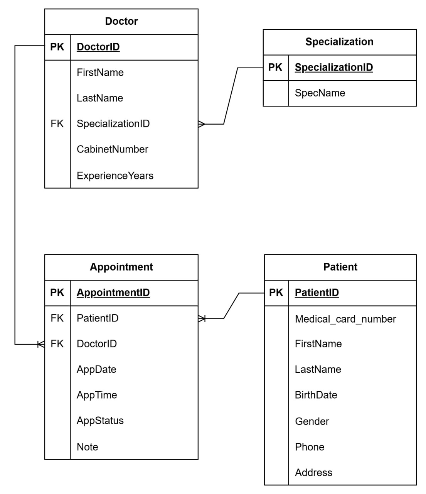

# Проектування бази даних «Реєстратура лікарні»
## Призначення системи 
Автоматизація роботи реєстратури для обліку пацієнтів, керування графіком лікарів та запису на прийом.

## Зацікавлені сторони
Медичні реєстратори (Адміністратори) - Реєстрація пацієнтів та видача «талончиків».

Лікарі - Консультація та зміна статусу запису (наприклад, «Прийом відбувся»).

Пацієнти - Отримання медичної допомоги в призначений час без черг.

Головний лікар (Керівництво лікарні) - Оптимізація роботи персоналу та контроль якості обслуговування.

## Дані для зберігання
Дані про пацієнтів.

Дані про лікарів.

Дані про записи на прийом.

Спеціалізації лікарів в лікарні.

## Бізнес-правила
Один лікар не може приймати двох пацієнтів одночасно. Запис на конкретну дату та час до конкретного лікаря має бути унікальним.

Один пацієнт не може бути записаний до двох різних лікарів, якщо час їхнього прийому перетинається.

Кожен лікар повинен мати хоча б одну спеціалізацію. Без зазначення спеціалізації лікар не може з'явитися у списку для запису пацієнтів.

Кожен пацієнт повинен мати унікальний номер медичної карти. Створення дублікатів пацієнтів за ПІБ та датою народження має блокуватися системою.

## ER-Діаграма

## Сутності та їх атрибути

### Patient
Ця сутність зберігає персональні та контактні дані осіб, які звертаються за медичною допомогою.

**Атрибути:**
- `PatientID` (PK): Унікальний ідентифікатор пацієнта (номер медичної карти).
- `FirstName`: Ім'я пацієнта.
- `LastName`: Прізвище пацієнта.
- `BirthDate`: Дата народження пацієнта.
- `Gender`: Стать.
- `Phone`: Контактний номер телефону.
- `Address`: Адреса проживання.

**Звʼязки:**
- Один пацієнт може мати одну або багато записів до лікаря.

---

### Doctor
Сутність містить інформацію про медичний персонал, до якого здійснюється запис.

**Атрибути:**
- `DoctorID` (PK): Унікальний ідентифікатор лікаря.
- `FirstName`: Ім'я лікаря.
- `LastName`: Прізвище лікаря.
- `SpecializationID` (FK): Діяльность лікаря.
- `CabinetNumber`: Номер кабінету, де проводиться прийом.
- `ExperienceYears`: Кількість років професійного стажу.

**Звʼязки:**
- Один лікарь може мати одну спеціалізацію.
- Один лікарь може мати одну або багато записів до нього.

---

### Specialization
Це довідкова таблиця, яка дозволяє класифікувати лікарів за їхнім фахом.

**Атрибути:**
- `SpecializationID` (PK): Унікальний код спеціалізації.
- `SpecName`: Назва спеціалізації.

**Звʼязки:**
- Одна спеціалізація може належати декільком лікарям.

---

### Appointment
Ключова асоціативна сутність, яка фіксує взаємодію між пацієнтом та лікарем у часі.

**Атрибути:**
- `AppointmentID` (PK): Номер талона або унікальний номер запису.
- `PatientID` (FK): Посилання на пацієнта, який записався.
- `DoctorID` (FK): Посилання на лікаря, до якого здійснюється візит.
- `AppDate`: Дата, на яку призначено прийом.
- `AppTime`: Точний час початку прийому.
- `Status`: Поточний стан запису.
- `Note`: Додаткова інформація.

**Звʼязки:**
- Один запис прив'язаний до одного пацієнта.
- Один запис прив'язаний до походу одного лікаря.
