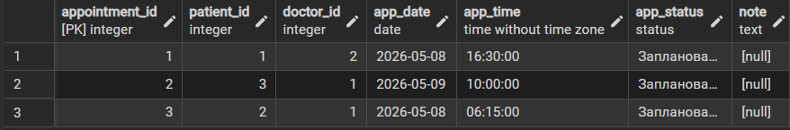
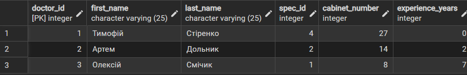
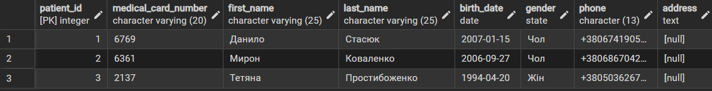
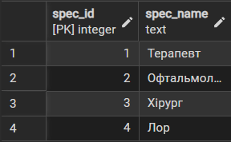

# Лабораторна робота №2
## Перетворення ER-діаграми у реляційну схему PostgreSQL

---

## Мета роботи

Метою даної лабораторної роботи є перетворення ER-діаграми предметної області
у реляційну схему та її реалізація у СУБД PostgreSQL.

---

## Опис

База даних призначена для зберігання інформації реєстратури лікарні.

Система дозволяє:
- Зберігати дані про пацієнтів,
- Зберігати інформацію про лікарів та їх спеціалізацію,
- Робити записи до фахового лікаря за часом та днем,
- Додавати нові спеціалізації лікарів до реєстру лікарні.

---

## Реляційна схема бази даних

- Specialization(`spec_id`, spec_name)
- Doctor(`doctor_id`, first_name, last_name, `spec_id`, cabinet_number, experiens_years)
- Patient(`patient_id`, medical_card_number, first_name, last_name, birth_date, gender, phone, address)
- Appointment(`appointment_id`, `patient_id`, `doctor_id`, app_date, app_time, app_status)

## Основні звʼязки між таблицями

- Одна спеціалізація може належати багатьом лікарям, але кожен лікар має одну основну спеціалізацію.
- Один пацієнт може мати багато записів на прийом, але один конкретний запис належить лише одному пацієнту.
- Один лікар має багато записів у своєму графіку, але кожен окремий запис у певний час стосується лише одного конкретного лікаря.

## Користувацькі типи даних (ENUM)

- `state`: `Чол`, `Жін`, `Нічого`
- `status`: `Заплановано`, `Завершено`, `Скасовано`, `Пропущено`

## Реалізація у PostgreSQL

```sql
CREATE TABLE IF NOT EXISTS Specialization(
	spec_id SERIAL PRIMARY KEY,
	spec_name TEXT UNIQUE NOT NULL
);

INSERT INTO Specialization(spec_name)
VALUES
	('Терапевт'),
	('Офтальмолог'),
	('Хірург'),
	('Лор');

CREATE TABLE IF NOT EXISTS Doctor(
	doctor_id SERIAL PRIMARY KEY,
	first_name VARCHAR(25) NOT NULL,
	last_name VARCHAR(25) NOT NULL,
	spec_id INT REFERENCES Specialization(spec_id) NOT NULL,
	cabinet_number INT CHECK(cabinet_number>0 AND cabinet_number<100) NOT NULL,
	experience_years INT CHECK(experience_years>=0) DEFAULT 0
);

INSERT INTO Doctor(first_name, last_name, spec_id, cabinet_number, experience_years)
VALUES
	('Тимофій', 'Стіренко', 4, 27, 0),
	('Артем', 'Дольник', 2, 14, 2),
	('Олексій', 'Смічик', 1, 8, 7);

DO $$
BEGIN
	IF NOT EXISTS (SELECT 1 FROM pg_type WHERE typname='state') THEN
		CREATE TYPE state as enum ('Чол', 'Жін', 'Нічого');
	END IF;
END$$;

CREATE TABLE IF NOT EXISTS Patient(
	patient_id SERIAL PRIMARY KEY,
	medical_card_number VARCHAR(20) UNIQUE NOT NULL,
	first_name VARCHAR(25) NOT NULL,
	last_name VARCHAR(25) NOT NULL,
	birth_date DATE NOT NULL,
	gender state DEFAULT 'Нічого',
	phone CHAR(13) NOT NULL,
	address TEXT,
	UNIQUE (first_name, last_name, birth_date)
);

INSERT INTO Patient(medical_card_number, first_name, last_name, birth_date, gender, phone)
VALUES
	('6769', 'Данило', 'Стасюк', '2007-01-15', 'Чол', '+380674190532'),
	('6361', 'Мирон', 'Коваленко', '2006-09-27', 'Чол', '+380686704231'),
	('2137', 'Тетяна', 'Простибоженко', '1994-04-20', 'Жін', '+380503626719');

DO $$
BEGIN
	IF NOT EXISTS (SELECT 1 FROM pg_type WHERE typname='status') THEN
		CREATE TYPE status as enum ('Заплановано', 'Завершено', 'Скасовано', 'Пропущено');
	END IF;
END$$;

CREATE TABLE IF NOT EXISTS Appointment(
	appointment_id SERIAL PRIMARY KEY,
	patient_id INT REFERENCES Patient(patient_id) NOT NULL,
	doctor_id INT REFERENCES Doctor(doctor_id) NOT NULL,
	app_date DATE NOT NULL,
	app_time TIME NOT NULL,
	app_status status DEFAULT 'Заплановано',
	note TEXT,
	UNIQUE (doctor_id, app_date, app_time)
);

INSERT INTO Appointment(patient_id, doctor_id, app_date, app_time)
VALUES 
	(1, 2, '2026-05-08', '16:30:00'),
	(3, 1, '2026-05-09', '10:00:00'),
	(2, 1, '2026-05-08', '06:15:00');
```

## Тестування

Додавання тестових даних до таблиць:
### Appointment

### Doctor

### Patient

### Specialization


Усі SQL-скрипти виконуються без помилок.

---

## Висновки
У результаті виконання лабораторної роботи:
- ER-діаграма була успішно перетворена у реляційну схему,
- реалізовано таблиці з первинними та зовнішніми ключами,
- використано ENUM-типи для забезпечення цілісності даних,
- схема протестована на коректність у PostgreSQL.
