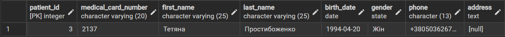
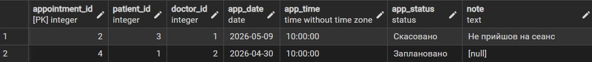
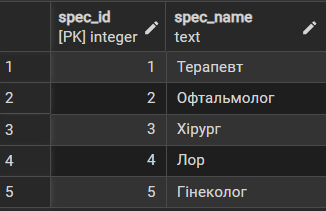
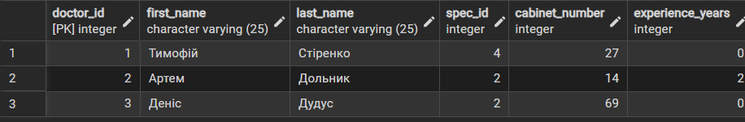

# Лабораторна робота №3

## Маніпулювання даними SQL (OLTP)

### SQL-скрипт(и)

```sql
-- Оновлення статусу записа пацієнта до лікаря
-- Результат: відповідний запис оновлюється, додається примітка.
UPDATE appointment
SET app_status = 'Скасовано', note = 'Не прийшов на сеанс'
WHERE patient_id = 3;

-- Оновлення статусу запису поцієнта до лікаря
-- Результат: статус змінюється на “Завершено”.
UPDATE appointment
SET app_status = 'Завершено', note = 'Скарг немає'
WHERE patient_id = 2;

-- Видалення лікаря за кодом спеціалізації
-- Результат: записи лікарів видаляються.
DELETE FROM doctor
WHERE spec_id = 1;

-- Видалення всіх завершених прийомів
-- Результат: всі такі прийоми видаляються.
DELETE FROM appointment
WHERE app_status = 'Завершено';

-- Видалення пацієнта за ім'ям
-- Результат: запис пацієнта видаляється.
DELETE FROM patient
WHERE first_name = 'Мирон' and last_name='Коваленко';

-- Додавання нової спеціалізації
-- Результат: новий рядок у таблиці.
INSERT INTO specialization(spec_name)
VALUES ('Гінеколог');

-- Додавання нового лікаря
-- Результат: новий лікар зі спеціалізацією №2.
INSERT INTO doctor(first_name, last_name, spec_id, cabinet_number, experience_years)
VALUES ('Деніс', 'Дудус', 2, 69, 0);

-- Додавання нового запису до лікаря
-- Результат: новий прийом.
INSERT INTO appointment(patient_id, doctor_id, app_date, app_time)
VALUES (1, 2, '2026-04-30', '10:00:00');
```
```sql
-- Вивести пацієнтів хто народився 1994 і раніше
-- 
SELECT * FROM patient
WHERE birth_date <= '1994-12-31';
```


```sql
-- Вивести всі прийому до 10 години
SELECT * FROM appointment
WHERE app_time <='10:00:00';
```


```sql
-- Вивести всы спеціалізації
SELECT * FROM specialization;
```



```sql
-- Вивести всіх лікарів
SELECT * FROM doctor;
```


