# Лабораторна робота №4

## Маніпулювання даними SQL (OLAP)

### SQL-скрипт(и)

```sql
-- Кількість лікарів по спеціалізаціях
-- щоб бачити розподіл персоналу (де є дефіцит/перевантаження)
SELECT s.spec_name, COUNT(d.doctor_id) AS doctor_count
FROM specialization s
LEFT JOIN doctor d ON s.spec_id = d.spec_id
GROUP BY s.spec_name;
```

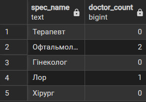
```sql
-- Середній стаж лікарів по спеціалізаціях
-- оцінка кваліфікації по напрямках
SELECT s.spec_name, AVG(d.experience_years) AS avg_experience
FROM specialization s
JOIN doctor d ON s.spec_id = d.spec_id
GROUP BY s.spec_name;
```

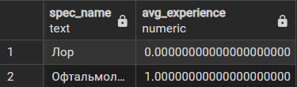
```sql
-- Кількість прийомів у кожного лікаря
-- аналіз навантаження
SELECT d.doctor_id, d.last_name, COUNT(a.appointment_id) AS total_appointments
FROM doctor d
LEFT JOIN appointment a ON d.doctor_id = a.doctor_id
GROUP BY d.doctor_id, d.last_name;
```

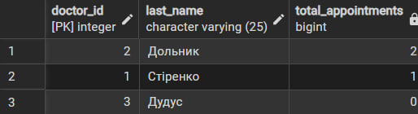
```sql
-- Мінімальний і максимальний стаж лікарів
-- швидка оцінка діапазону досвіду
SELECT MIN(experience_years) AS min_exp,
       MAX(experience_years) AS max_exp
FROM doctor;
```

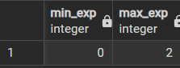
```sql
-- Кількість прийомів за статусом
-- контроль якості (скільки скасовано, завершено тощо)
SELECT app_status, COUNT(*) AS count_status
FROM appointment
GROUP BY app_status;
```

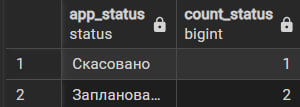
```sql
-- Список прийомів з лікарем і пацієнтом
-- повна інформація про прийоми
SELECT p.first_name, p.last_name,
       d.first_name AS doc_name, d.last_name AS doc_surname,
       a.app_date, a.app_time
FROM appointment a
INNER JOIN patient p ON a.patient_id = p.patient_id
INNER JOIN doctor d ON a.doctor_id = d.doctor_id;
```

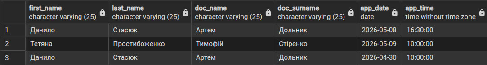
```sql
-- Всі лікарі (навіть без прийомів)
-- знайти “вільних” лікарів
SELECT d.first_name, d.last_name, a.appointment_id
FROM doctor d
LEFT JOIN appointment a ON d.doctor_id = a.doctor_id;
```

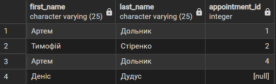
```sql
-- Всі лікарі і всі прийоми
-- повний аудит даних
SELECT d.last_name, a.appointment_id
FROM doctor d
FULL JOIN appointment a ON d.doctor_id = a.doctor_id;
```

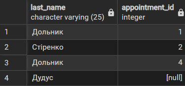
```sql
-- Лікарі з максимальним стажем
-- визначення найдосвідченіших
SELECT *
FROM doctor
WHERE experience_years = (
    SELECT MAX(experience_years) FROM doctor
);
```

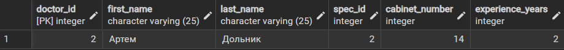
```sql
-- Пацієнти, які мають хоча б один запис
-- відсікає “неактивних” пацієнтів
SELECT *
FROM patient
WHERE patient_id IN (
    SELECT DISTINCT patient_id FROM appointment
);
```

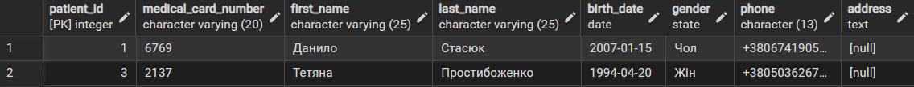
```sql
-- Кількість прийомів для кожного лікаря
SELECT d.first_name, d.last_name,
       (SELECT COUNT(*)
        FROM appointment a
        WHERE a.doctor_id = d.doctor_id) AS appointment_count
FROM doctor d;
```

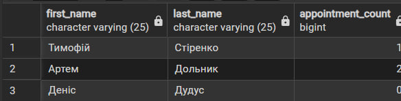
