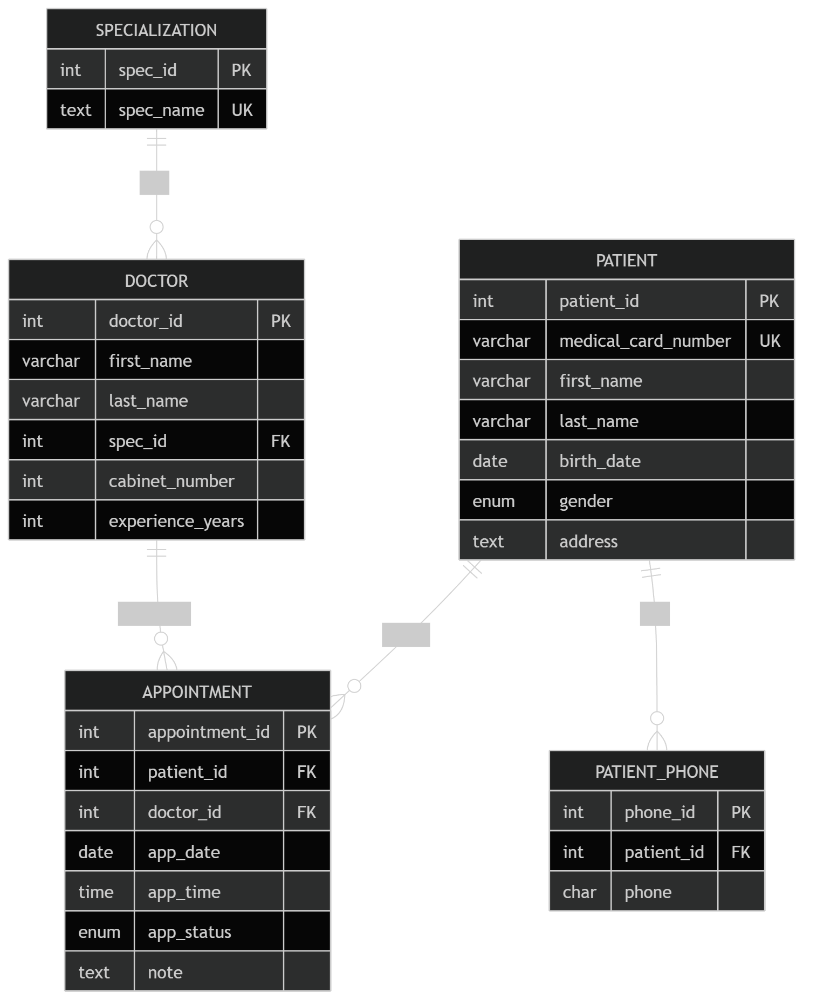

# Звіт з нормалізації бази даних медичної системи

## Мета роботи

* Виявити надлишковість даних та аномалії оновлення.
* Визначити функціональні залежності (ФЗ).
* Перевірити нормальні форми таблиць.
* Виконати нормалізацію до 3НФ.
* Підготувати SQL DDL-скрипти для фінальної схеми.

---

# 1. Початкова схема бази даних

## Таблиця `Specialization`

| Поле      | Тип         | Опис                        |
| --------- | ----------- | --------------------------- |
| spec_id   | SERIAL PK   | Ідентифікатор спеціалізації |
| spec_name | TEXT UNIQUE | Назва спеціалізації         |

## Таблиця `Doctor`

| Поле             | Тип         | Опис                 |
| ---------------- | ----------- | -------------------- |
| doctor_id        | SERIAL PK   | Ідентифікатор лікаря |
| first_name       | VARCHAR(25) | Ім’я                 |
| last_name        | VARCHAR(25) | Прізвище             |
| spec_id          | INT FK      | Спеціалізація        |
| cabinet_number   | INT         | Номер кабінету       |
| experience_years | INT         | Стаж роботи          |

## Таблиця `Patient`

| Поле                | Тип                | Опис                   |
| ------------------- | ------------------ | ---------------------- |
| patient_id          | SERIAL PK          | Ідентифікатор пацієнта |
| medical_card_number | VARCHAR(20) UNIQUE | Номер медичної картки  |
| first_name          | VARCHAR(25)        | Ім’я                   |
| last_name           | VARCHAR(25)        | Прізвище               |
| birth_date          | DATE               | Дата народження        |
| gender              | ENUM               | Стать                  |
| phone               | CHAR(13)           | Телефон                |
| address             | TEXT               | Адреса                 |

## Таблиця `Appointment`

| Поле           | Тип       | Опис                  |
| -------------- | --------- | --------------------- |
| appointment_id | SERIAL PK | Ідентифікатор прийому |
| patient_id     | INT FK    | Пацієнт               |
| doctor_id      | INT FK    | Лікар                 |
| app_date       | DATE      | Дата прийому          |
| app_time       | TIME      | Час прийому           |
| app_status     | ENUM      | Статус                |
| note           | TEXT      | Примітка              |

---

# 2. Аналіз надлишковості та аномалій

## 2.1 Таблиця `Patient`

### Виявлена проблема

У таблиці `Patient` поле `phone` зберігається безпосередньо в основній таблиці пацієнтів.

### Недоліки

1. Один пацієнт може мати декілька номерів телефону.
2. Для зберігання кількох номерів доведеться:

   * дублювати записи пацієнта;
   * або зберігати список телефонів в одному полі.

### Аномалії

#### Аномалія вставки

Неможливо додати додатковий телефон без зміни існуючого запису.

#### Аномалія оновлення

При зміні номера телефону доводиться редагувати запис пацієнта.

#### Аномалія видалення

При видаленні пацієнта втрачаються всі його телефони.

### Висновок

Поле `phone` потрібно винести в окрему таблицю.

---

# 3. Функціональні залежності

## 3.1 Таблиця `Specialization`

### Ключ

* `spec_id`

### Функціональні залежності

```text
spec_id → spec_name
spec_name → spec_id
```

### Нормальна форма

Таблиця перебуває у 3НФ.

---

## 3.2 Таблиця `Doctor`

### Ключ

* `doctor_id`

### Функціональні залежності

```text
doctor_id → first_name, last_name, spec_id, cabinet_number, experience_years
```

### Аналіз

* Усі неключові атрибути залежать тільки від первинного ключа.
* Часткових залежностей немає.
* Транзитивних залежностей немає.

### Нормальна форма

Таблиця перебуває у 3НФ.

---

## 3.3 Таблиця `Patient`

### Ключ

* `patient_id`
* альтернативний ключ: `medical_card_number`

### Функціональні залежності

```text
patient_id → medical_card_number, first_name, last_name, birth_date, gender, phone, address
medical_card_number → patient_id, first_name, last_name, birth_date, gender, phone, address
```

### Проблема

Атрибут `phone` є багатозначним.

### Нормальна форма

Таблиця порушує 1НФ, оскільки:

* телефон може бути множинним атрибутом;
* структура не гарантує атомарність значення.

---

## 3.4 Таблиця `Appointment`

### Ключ

* `appointment_id`
* альтернативний ключ: `(doctor_id, app_date, app_time)`

### Функціональні залежності

```text
appointment_id → patient_id, doctor_id, app_date, app_time, app_status, note
(doctor_id, app_date, app_time) → appointment_id, patient_id, app_status, note
```

### Аналіз

* Часткових залежностей немає.
* Транзитивних залежностей немає.

### Нормальна форма

Таблиця перебуває у 3НФ.

---

# 4. Нормалізація

# 4.1 Перехід до 1НФ

## Проблема

У таблиці `Patient` атрибут `phone` може містити декілька значень.

## Рішення

Створено окрему таблицю `PatientPhone`.

---

## Початкова структура

```sql
CREATE TABLE Patient(
    patient_id SERIAL PRIMARY KEY,
    medical_card_number VARCHAR(20) UNIQUE NOT NULL,
    first_name VARCHAR(25) NOT NULL,
    last_name VARCHAR(25) NOT NULL,
    birth_date DATE NOT NULL,
    gender state DEFAULT 'Нічого',
    phone CHAR(13) NOT NULL,
    address TEXT
);
```

---

## Зміни

### Видалення поля `phone`

```sql
ALTER TABLE Patient
DROP COLUMN phone;
```

### Створення таблиці телефонів

```sql
CREATE TABLE PatientPhone(
    phone_id SERIAL PRIMARY KEY,
    patient_id INT REFERENCES Patient(patient_id) ON DELETE CASCADE,
    phone CHAR(13) NOT NULL
);
```

---

## Результат

Тепер:

* один пацієнт може мати багато телефонів;
* усі значення є атомарними;
* структура відповідає 1НФ.

---

# 4.2 Перехід до 2НФ

## Аналіз

Після переходу до 1НФ:

* усі таблиці мають прості первинні ключі;
* складених ключів із частковими залежностями немає.

### Висновок

Схема автоматично відповідає 2НФ.

---

# 4.3 Перехід до 3НФ

## Аналіз

Після винесення телефонів:

* усі неключові атрибути залежать тільки від ключів;
* транзитивних залежностей не залишилось.

### Висновок

Усі таблиці перебувають у 3НФ.

---

# 5. Фінальна схема бази даних (3НФ)

## Таблиця `Specialization`

```sql
CREATE TABLE IF NOT EXISTS Specialization(
    spec_id SERIAL PRIMARY KEY,
    spec_name TEXT UNIQUE NOT NULL
);
```

---

## Таблиця `Patient`

```sql
CREATE TYPE state_gender as enum ('Чол', 'Жін', 'Нічого');

CREATE TABLE Patient(
    patient_id SERIAL PRIMARY KEY,
    medical_card_number VARCHAR(20) UNIQUE NOT NULL,
    first_name VARCHAR(25) NOT NULL,
    last_name VARCHAR(25) NOT NULL,
    birth_date DATE NOT NULL,
    gender state_gender DEFAULT 'Нічого',
    address TEXT
);
```

---

## Таблиця `PatientPhone`

```sql
CREATE TABLE PatientPhone(
    phone_id SERIAL PRIMARY KEY,
    patient_id INT REFERENCES Patient(patient_id) ON DELETE CASCADE,
    phone CHAR(13) NOT NULL
);
```

---

## Таблиця `Doctor`

```sql
CREATE TABLE IF NOT EXISTS Doctor(
    doctor_id SERIAL PRIMARY KEY,
    first_name VARCHAR(25) NOT NULL,
    last_name VARCHAR(25) NOT NULL,
    spec_id INT REFERENCES Specialization(spec_id) NOT NULL,
    cabinet_number INT CHECK(cabinet_number > 0 AND cabinet_number < 100) NOT NULL,
    experience_years INT CHECK(experience_years >= 0) DEFAULT 0
);
```

---

## Таблиця `Appointment`

```sql
CREATE TYPE status_appointment as enum (
    'Заплановано',
    'Завершено',
    'Скасовано',
    'Пропущено'
);

CREATE TABLE Appointment(
    appointment_id SERIAL PRIMARY KEY,
    patient_id INT REFERENCES Patient(patient_id),
    doctor_id INT REFERENCES Doctor(doctor_id),
    app_date DATE NOT NULL,
    app_time TIME NOT NULL,
    app_status status_appointment DEFAULT 'Заплановано',
    note TEXT,
    UNIQUE (doctor_id, app_date, app_time)
);
```

---

# 6. ER-модель після нормалізації

## ER Diagram



## Основні зв’язки

### `Specialization` ← `Doctor`

* Один тип спеціалізації може належати багатьом лікарям.
* Зв’язок: 1:M.

### `Patient` ← `PatientPhone`

* Один пацієнт може мати багато телефонів.
* Зв’язок: 1:M.

### `Patient` ← `Appointment`

* Один пацієнт може мати багато прийомів.
* Зв’язок: 1:M.

### `Doctor` ← `Appointment`

* Один лікар може мати багато прийомів.
* Зв’язок: 1:M.

---

# 7. Переваги після нормалізації

## Усунення надлишковості

* Телефони більше не дублюються.
* Дані пацієнтів не повторюються.

## Усунення аномалій

* Можна додавати необмежену кількість телефонів.
* Оновлення номера не впливає на інші дані.
* Видалення телефону не видаляє пацієнта.

## Покращення структури

* База даних стала масштабованою.
* Підвищилась цілісність даних.
* Спрощено підтримку системи.

---

# 8. Висновок

У ході роботи було:

1. Проаналізовано початкову OLTP-схему.
2. Визначено функціональні залежності.
3. Перевірено нормальні форми таблиць.
4. Виявлено проблему багатозначного атрибута `phone`.
5. Виконано нормалізацію до 3НФ.
6. Створено фінальну схему з окремою таблицею `PatientPhone`.

Фінальна структура відповідає вимогам 3НФ та усуває аномалії вставки, оновлення й видалення.
