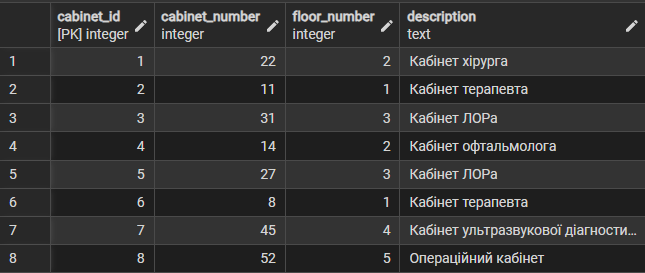
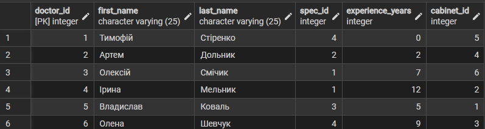
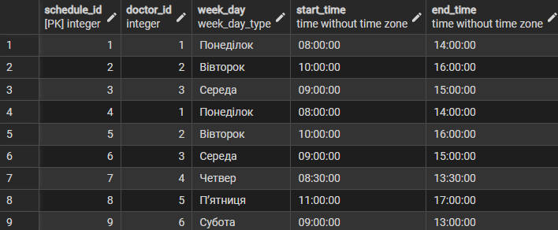
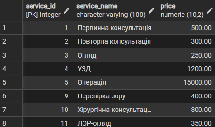
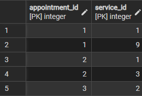
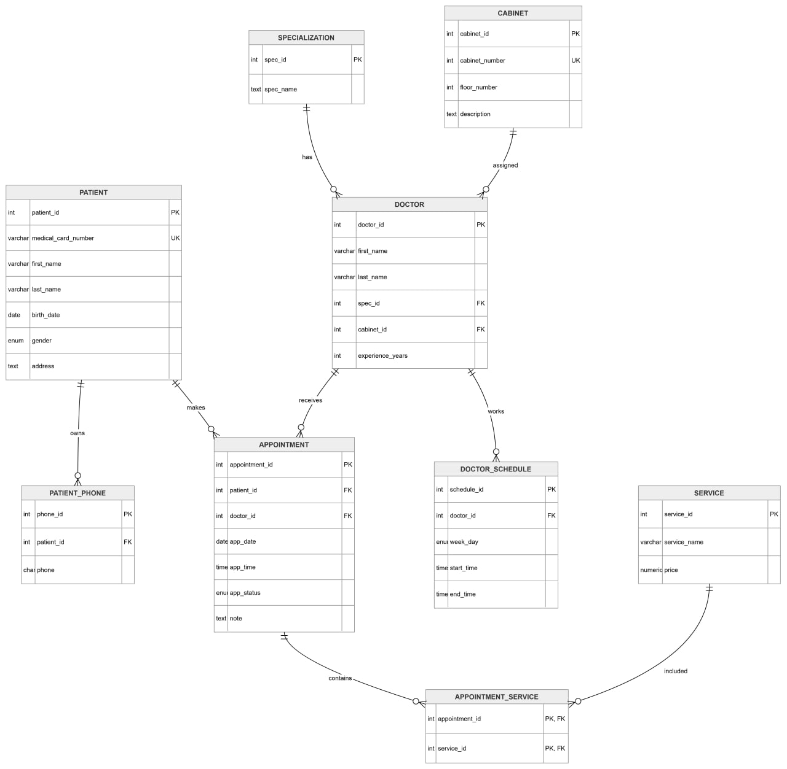

# Лабораторна робота 6

## Загальна інформація

Тема проєкту: **Реєстратура лікарні: облік хворих та запис до лікарів на прийом**

У проєкті використано:
- Maven
- Flyway

Міграції розташовані у:

```text
src/main/resources/db/migration/
```

---

# Список міграцій

| Версія | Назва |
|---|---|
| V2 | create_cabinet_table |
| V3 | create_doctor_schedule_table |
| V4 | create_service_tables |
| V5 | insert_data_after_migrations |
| V6 | update_data_after_migrations |

---

# V2__create_cabinet_table.sql

## Що було змінено

Було виконано нормалізацію даних про кабінети.

До міграції:
- номер кабінету зберігався в таблиці Doctor.

Після міграції:
- створена окрема таблиця Cabinet;
- таблиця Doctor містить cabinet_id.

---

## Додані таблиці

### Cabinet
Таблиця кабінетів лікарні.

---

## Основні зміни

### Створення Cabinet

```sql
CREATE TABLE Cabinet (
    cabinet_id SERIAL PRIMARY KEY,
    cabinet_number INT UNIQUE NOT NULL,
    floor_number INT,
    description TEXT
);
```

### Додавання cabinet_id

```sql
ALTER TABLE Doctor
ADD COLUMN cabinet_id INT REFERENCES Cabinet(cabinet_id);
```

### Видалення старої колонки

```sql
ALTER TABLE Doctor
DROP COLUMN cabinet_number;
```

---

## Причина змін

Покращення нормалізації:
- усунення дублювання;
- можливість зберігати додаткову інформацію про кабінети;
- приведення БД до 3НФ.

---

## Перевірка результату

```sql
SELECT * FROM Cabinet;

SELECT * FROM Doctor;
```

---

## Скріншоти

### Таблиця Cabinet після міграції



### Таблиця Doctor після оновлення



---

# V3__create_doctor_schedule_table.sql

## Що було додано

Було додано систему графіків роботи лікарів.

---

## Додані таблиці

### DoctorSchedule
Таблиця графіків лікарів.

---

## Основні зміни

### ENUM для днів тижня

```sql
CREATE TYPE week_day_type AS ENUM (
    'Понеділок',
    'Вівторок',
    'Середа',
    'Четвер',
    'Пʼятниця',
    'Субота',
    'Неділя'
);
```

### Таблиця графіків

```sql
CREATE TABLE DoctorSchedule (
    schedule_id SERIAL PRIMARY KEY,
    doctor_id INT NOT NULL REFERENCES Doctor(doctor_id),
    week_day week_day_type NOT NULL,
    start_time TIME NOT NULL,
    end_time TIME NOT NULL
);
```

---

## Причина змін

Тепер:
- один лікар може мати кілька робочих днів;
- графік не дублюється;
- дані приведені до 3НФ.

---

## Перевірка результату

```sql
SELECT * FROM DoctorSchedule;
```

---

## Скріншоти

### Таблиця DoctorSchedule



---

# V4__create_service_tables.sql

## Що було додано

Було створено систему послуг лікарні.

---

## Додані таблиці

### Service
Таблиця медичних послуг.

### AppointmentService
Проміжна таблиця для зв’язку багато-до-багатьох.

---

## Основні зміни

### Таблиця послуг

```sql
CREATE TABLE Service (
    service_id SERIAL PRIMARY KEY,
    service_name VARCHAR(100) UNIQUE NOT NULL,
    price NUMERIC(10,2) NOT NULL
);
```

### Таблиця зв’язків

```sql
CREATE TABLE AppointmentService (
    appointment_id INT REFERENCES Appointment(appointment_id),
    service_id INT REFERENCES Service(service_id),
    PRIMARY KEY (appointment_id, service_id)
);
```

---

## Причина змін

Один прийом:
- може містити кілька послуг.

Одна послуга:
- може використовуватись у багатьох прийомах.

---

## Перевірка результату

```sql
SELECT * FROM Service;

SELECT * FROM AppointmentService;
```

---

## Скріншоти

### Таблиця Service



### Таблиця AppointmentService



---

# V5__insert_data_after_migrations.sql

## Що було додано

Було додано тестові дані після виконання основних міграцій.

Було:
- додано нові кабінети;
- додано графіки лікарів;
- додано медичні послуги;
- додано зв’язки між прийомами та послугами.

---

## Приклади SQL

### Додавання послуг

```sql
INSERT INTO Service(service_name, price)
VALUES
    ('Первинна консультація', 500.00),
    ('УЗД', 1200.00);
```

### Додавання графіків

```sql
INSERT INTO DoctorSchedule(
    doctor_id,
    week_day,
    start_time,
    end_time
)
VALUES
(
    1,
    'Понеділок',
    '08:00',
    '14:00'
);
```

---

## Перевірка результату

```sql
SELECT * FROM Service;

SELECT * FROM DoctorSchedule;
```

---

## Скріншоти

### Дані таблиці Service


### Дані таблиці DoctorSchedule


---

# V6__update_data_after_migrations.sql

## Що було змінено

Було оновлено дані після завершення всіх міграцій.

Було:
- оновлено поверхи кабінетів;
- додано опис кабінетів;
- оновлено інформацію про послуги;
- додано додаткові зв’язки між прийомами та послугами.

---

## Приклади SQL

### Оновлення кабінетів

```sql
UPDATE Cabinet
SET floor_number = 2,
    description = 'Кабінет офтальмолога'
WHERE cabinet_number = 14;
```

### Оновлення зв’язків послуг

```sql
INSERT INTO AppointmentService(appointment_id, service_id)
SELECT 1, service_id
FROM Service
WHERE service_name = 'Огляд';
```

---

## Перевірка результату

```sql
SELECT * FROM Cabinet;

SELECT * FROM AppointmentService;
```

---

## Скріншоти

### Оновлена таблиця Cabinet


### Оновлена таблиця AppointmentService


---

# Нормалізація бази даних

База даних приведена до **третьої нормальної форми (3НФ)**.

---

## 1НФ

Виконано:
- усі поля атомарні;
- телефони винесені в окрему таблицю PatientPhone.

---

## 2НФ

Виконано:
- усі неключові атрибути залежать від повного первинного ключа.

---

## 3НФ

Виконано:
- спеціалізації винесені в окрему таблицю;
- кабінети винесені в Cabinet;
- графік винесений у DoctorSchedule;
- послуги винесені в Service;
- зв’язок багато-до-багатьох реалізований через AppointmentService.

---

# Flyway

## Запуск міграцій

```bash
mvn flyway:migrate
```

## Перевірка міграцій

```bash
mvn flyway:info
```

---

# Висновок

У результаті:
- створено повноцінну БД реєстратури лікарні;
- реалізовано систему міграцій Flyway;
- виконано нормалізацію до 3НФ;
- додано тестові дані;
- створено ER-діаграму;
- перевірено застосування міграцій через SELECT-запити.
  